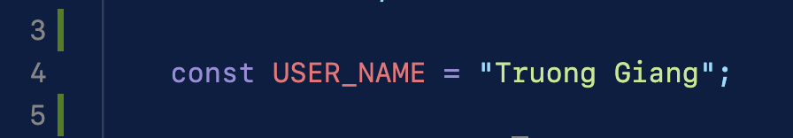
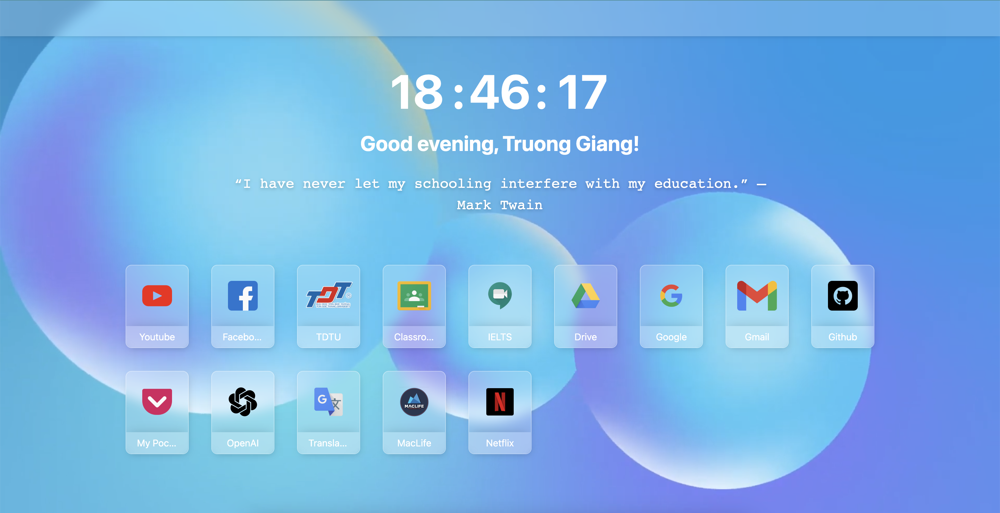

# Glassmorphism Theme Extension

Welcome to the exciting world of **Glassmorphism**! Glassmorphism is a relatively new design trend that has been gaining popularity among web and app designers. It is a style that aims to create a realistic glass-like effect by using translucent layers, shadows, and highlights. This technique creates a visually appealing interface that can add depth, clarity, and sophistication to your design.

# Configuration

Change your name to display in script file "**assets/js/content.js**"

# Screenshot

Thank you, hope you enjoy!
